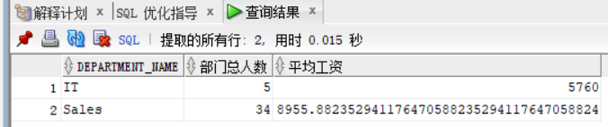
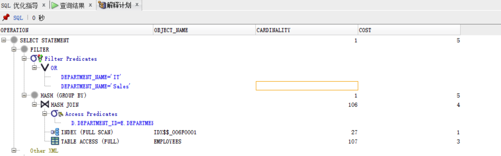

# 实验一：分析SQL执行计划，执行SQL语句的优化指导
## 教材中的查询语句
查询1：
```SQL
SELECT d.department_name,count(e.job_id)as "部门总人数",
avg(e.salary)as "平均工资"
from hr.departments d,hr.employees e
where d.department_id = e.department_id
and d.department_name in ('IT','Sales')
GROUP BY department_name;
```
执行结果：


分析：

*   执行计划


*   优化建议：sqldeveloper的优化指导工具给出了相应的优化建议，通过创建一个或多个索引可以改进此语句的执行计划。

查询2：
```SQL
SELECT d.department_name,count(e.job_id)as "部门总人数",
avg(e.salary)as "平均工资"
FROM hr.departments d,hr.employees e
WHERE d.department_id = e.department_id
GROUP BY department_name
HAVING d.department_name in ('IT','Sales');
```
执行结果：



分析：

*   执行计划



*   优化建议：sqldeveloper的优化指导工具未给出优化建议。

比较：
通过分析上面两个比较复杂的返回相同查询结果数据集的SQL语句各自的执行计划，比较消耗得出查询2更加快捷，原因是代码中使用having，先过滤再分组，提高了效率

